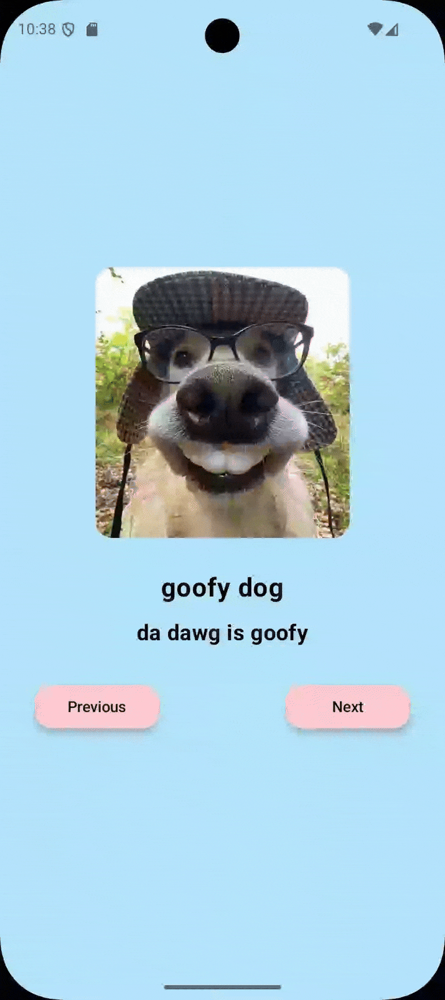

# 🖼️ ArtSpace App

This is a simple Android application made as part of the **Google Android Basics with Compose** course. The app displays a curated collection of images in a carousel-like layout where users can navigate between artworks using "Previous" and "Next" buttons.

## 📱 Features

- Smooth navigation between artworks
- Pastel-themed modern UI
- Designed for learning and practicing **Jetpack Compose basics**

## 📸 Screens

> **Note:** All images used in this project are sourced randomly from Google Images and are not owned by me. They are used for **educational and non-commercial purposes only**.

## 🎨 Tech Stack

- Kotlin
- Jetpack Compose
- Android Studio

## 🚀 Getting Started

To run the project locally:

1. Clone the repo  
   ```
   git clone https://github.com/rishantbana/artspace.git
   ```

2. Open it in **Android Studio** (preferably Hedgehog or later).

3. Build and run it on an emulator or real device running Android 8.0 (API 26) or above.

## 🧠 Learning Objective

This project helped me understand:

- `@Composable` functions
- State handling with `remember` and `mutableStateOf`
- Layouts using `Box`, `Row`, `Column`, and modifiers
- Custom theming and reusable components

## 🙋‍♂️ Author

**Rishant Bana**  
3rd Year B.Tech CSE Student  
GitHub: [RishantBana](https://github.com/RishantBana)
